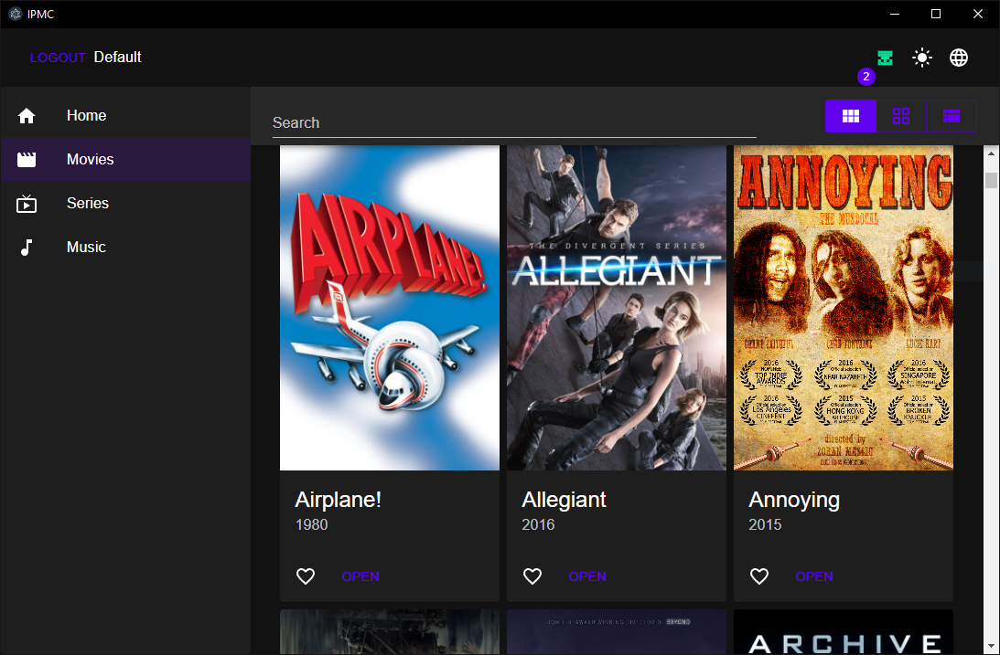

# IPMC

Interplanetary Media Center


A piece of software made to access media libraries hosted on [IPFS](https://ipfs.io).

## Screenshots



## Documentation

The documentation can be found [here](./docs/README.md)

## Getting started

### Prerequisites

- nodejs >= v20.12.2
- yarn (installed through [corepack](https://yarnpkg.com/corepack))

### Clone the repository

```shell
git clone https://github.com/undyingwraith/ipmc.git
cd ipmc
```

### Installing dependencies

```shell
yarn install
```

### Running it in dev mode

```shell
yarn dev
```

## Packages

| Path | Name | Description |
| - | - | - |
| ./packages/interfaces | **ipmc-interfaces** | Defines interfaces for MetaData and services. |
| ./packages/core | **ipmc-core** | Contains Services and utilities. |
| ./packages/ui | **ipmc-ui** | Contains a react app that acts as ui. |
| ./packages/desktop | **ipmc-desktop** | Contains a electron app using the *ipmc-ui*. |
| ./packages/webui | **ipmc-webui** | Contains a react app using the *ipmc-ui*. |

## Contributing
1. Fork the repository.
2. Create a new branch: `git checkout -b feature/feature-name`.
3. Make your changes.
4. Push your branch: `git push origin feature/feature-name`.
5. Create a pull request.

## License
This project is licensed under the [MIT License](LICENSE).

## Contributors

<a href="https://github.com/undyingwraith/ipmc/graphs/contributors">
  
</a>
